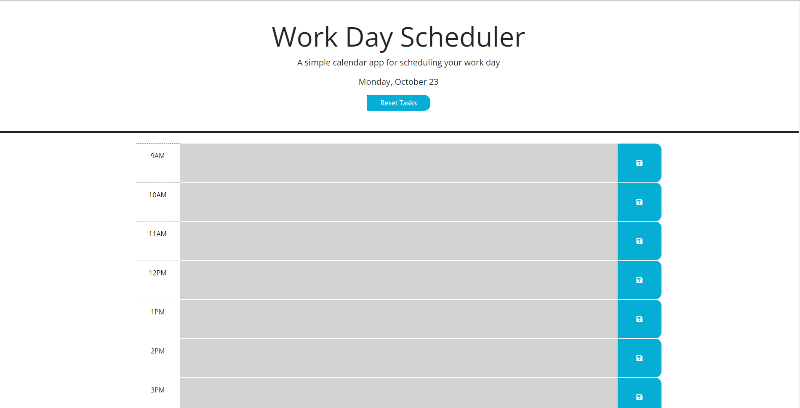

# Work Day Scheduler

## Description

This project was started with the intention of adding javascript that allows the pages text boxes to change colors according to what time it is. You can also add tasks into your time boxes that you can save using local storage. The basic structure of the index.html was provided already as well as the css but the script.js file had no code other than TODO comments. The page also updates using setInterval to keep up with the time without needing to be refreshed.

## Example of Work Day Scheduler

[Deployed Application Here](https://collinshepherd.github.io/work-day-schedule/)

## Usage

To use the website you can see the date at the top of the page as well as a reset tasks button. Going down the page you will see boxes with the time next to them and as they are in the future (still coming up) the entire box will be green, as it is currently that time the box will be red, and after it has pasted it will be gray. You can also add tasks todo inside of the grayed out area and save them will the save icon next to their corresponding box. These tasks will be saved on reload in local storage.

## Credits

Using the dayjs documentation to use the correct time https://day.js.org/docs/en/installation/installation

## License

Please refer to the LICENSE in the repo
